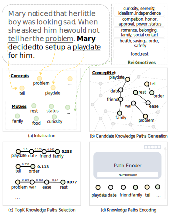
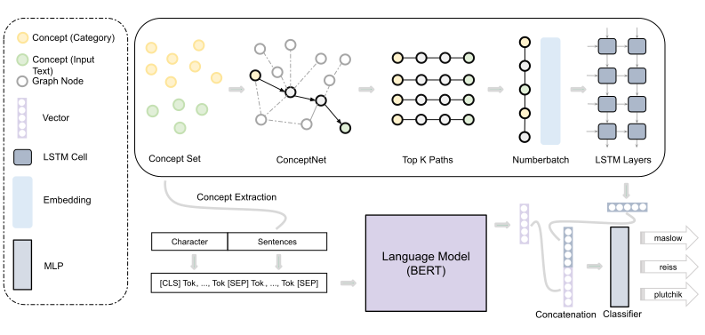
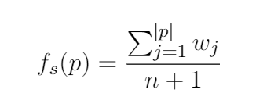
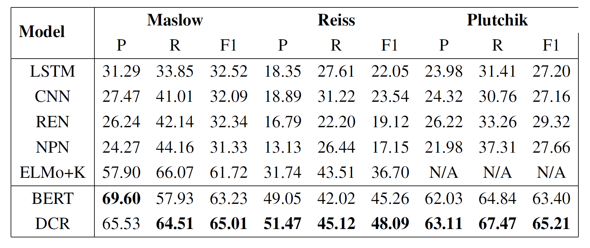
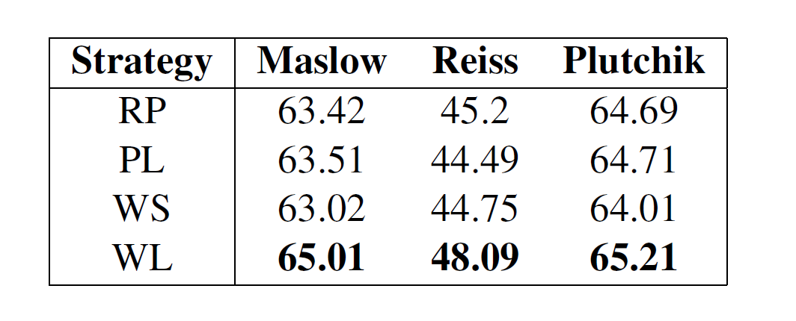

# Incorporating Explainable Paths Into Commonsense Reasoning on Human Emotions and Motives
> This manuscript is an attempt for incorporating commonsense graph with psychological reasoning.

## Abstract
The natural language processing community has concentrated on improving the performance of reasoning human emotions and their motives from the text but has paid little attention to give the interpretability for the results. To address this issue, I propose a dual commonsense reasoning model, **DCR**, which consists of a feature extraction module and an inference module based on the commonsense graph. Additionally, I also provide a simple and effective scoring strategy for paths. My experiments show that the proposed model achieves improvements against the [BERT](https://www.aclweb.org/anthology/N19-1423/) model, and provides the interpretability for the results through explainable inference steps to alleviate the concerns about the black box problem.

## 1. Introduction

    <figure>
        
        <figcaption>
        Fig.1 - An example of the process of the inference module on human motives.
        </figcaption>
    </figure>

Human emotions and their motives are essential types of commonsense knowledge concerning psychology, which drive our various complex behaviours, and are beneficial to those scenarios that need to speculate on human emotions and their motives, e.g., voice assistant and commodity recommendation. In the natural language processing community, a rich body of commonsense reasoning on emotions and their motives has been studied, such as sentiment analysis, emotion reasoning, and motive reasoning. Sentiment analysis is to analyze the opinion of the text, and its results are usually expressed by a positive or negative value called polarity. Emotion reasoning detects fine-grained sentiments through specific labels that most people can understand. Recently, motive reasoning also catches the attention of researchers, which can be considered as the reason for the corresponding emotion. However, most studies on emotion and motive reasoning typically give no reason for the results, which means that we do not know why the model outputs these reasoning results. It is necessary to provide the interpretability for the results as the rise of the public concern about the black box problem. 

The core problem is that the current model lacks a similar process of commonsense reasoning compared to the human mind. We humans are skilled in drawing inferences through concepts and statements to process from common sense to novel conclusions, with clear inference steps. Inspired by this process, I present **DCR**, a dual commonsense reasoning model mainly consists of a feature extraction module and an inference module based on the commonsense graph. The method stems from a simple idea that the commonsense reasoning result always has a conceptual correlation with the input.

Given a piece of natural language text, I mainly focus on reasoning the Maslow's needs, the Reiss' motives, and the Plutchik basic emotions, of a specific character that the text has mentioned (See [StoryCommonsense](https://uwnlp.github.io/storycommonsense/)). These categories define five coarse-grained motives from *psychological needs* to *spiritual growth*, nineteen fine-grained motives from *rest* to *curiosity*, and eight basic emotions from *anticipation to *joy*, separately. I consider these three tasks as a multi-label text classification problem. I consider BERT as the feature extraction module to encode the input text and generate a text representation. Furthermore, the inference module generates an inference representation via operating on a series of transparent inference steps in the commonsense graph (See Figure 1). Finally, a combination of the two representations is sent to the multi-label classifier, generating the final result. Experiments show that the dual commonsense reasoning model not only achieves better performance but also, to some extent, provides the interpretability for the reasoning results through showing inference steps.

## 2. Method

    <figure>
        
        <figcaption>
        Fig.2 - The Architecture of the Proposed Model DCR.
        </figcaption>
    </figure>

In this section, I will describe the main architecture of the proposed model, which can be seen in Figure 2. I will introduce the main parts of the proposed model, the feature extraction module, and the inference module in the following paragraphs.

### 2.1. Feature Extraction
BERT is designed to pre-train deep bidirectional representations by jointly conditioning on both left and right in all layers; It captures structure information from massive nature language text, such as phrasal-level information, syntactic features, and semantic features. Therefore, I choose BERT as the feature extraction module. This module takes in the input text and yields a text representation.

### 2.2. Inference
The inference module performs a series of steps in the commonsense graph to assist the feature extraction module for better decision making. The primary hypothesis behind this module is that we can enhance the confidence level for the classification result if we find out a path with a high score between the category label and the concept. The main algorithm divides into the following parts:

- Initialize.
  
  [ConceptNet](http://conceptnet.io/), a multilingual semantic graph, is designed to help computers to understand the meanings of words that people use. I initialize the commonsense graph with only English concepts from ConceptNet and some special relations from ConceptNet for reducing the computational complexity. For the convenience of the following sorting, the graph also includes the relation weight that represents how credible the information is. Besides, I extract concepts from the input text to form a concept set, and merge all category labels of the current tasks into a category label set.

- Generate.
  
  The first step of inference is to search all shortest paths that provide supporting facts between the concept and the category label in the commonsense graph. I denote these shortest paths as a list P.

- Select.
  
  When prepared all shortest paths, according to the path score, I select the top K (K = 2) shortest paths from the list P with descending order because there are too many shortest paths in each input instance, and some of them are noise. Therefore, I need to remove paths with a low confidence level, which should not be as supporting facts of the inference process. I score for each shortest path and sort all shortest paths by the score. I denote the scoring equation as:

    

        
    

    where w_j is the j-th relation weight, n is the number of nodes in the shortest path p. The larger the sum of relation weights of a path, the higher the path's score. However, it could get a larger sum of relation weights through a longer path. The longer path should have a lower confidence level. For example, I can always find out the shortest path between the concept "hungry" and the category label "honor" as long as there are enough nodes in the path. As we all know, the concept "hungry" is more related to the category label "food" than the category label "honor." Therefore, I limit this equation for lowing path's score by adding a denominator summed by the number of nodes, n, and one.

- Encode
  
  [ConceptNet Numberbatch](https://github.com/commonsense/conceptnet-numberbatch) consists of semantic vectors (also known as word embeddings) that can be used directly as the representation of concept meanings. I first form a node sequence S by linking the top K shortest paths one by one. Then, I use ConceptNet Numberbatch to embed the node sequence S for each concept. Finally, I use a two-layer LSTM to obtain the representation of the node sequence embedding and outputs a hidden state, as the inference vector.

### 2.3. Reasoning
This module concatenates the text representation vector and the inference vector and produces a final representation vector. Finally, the multi-label classifier, which includes a fully connected layer with sigmoid activations, predicts multiple binary category for each category through the input.

## 3. Experiments
### 3.1. Dataset
I use [storycommonsense](https://uwnlp.github.io/storycommonsense/) that contains 15,000 annotated commonsense stories to conduct my experiments. Each story has five short sentences, some characters, and psychological annotations (Maslow, Reiss, Plutchik). I only use the development and test sets (5,000 stories) of the original dataset, because authors of the dataset only annotate the motive and emotion labels for the development and test sets.

I also split all datasets into three portions of 80% training set, 10% development set, and 10% test set. I use the micro-averaged precision P, recall R, and F1 score as the metrics for evaluating my model's performance.

### 3.2. Model Details
My implementation of the language model is based on the PyTorch implementation of [BERT-base](https://github.com/huggingface/transformers). The hidden size H of BERT is 768. I use Adam as my optimizer with a learning rate of 5e-5 and a batch size of 128. All the activation functions in my model are ReLU.

The inference module shares the same optimizer and activation function with the feature extraction system, as well as the classifier. The hidden size H of LSTM is still 768.

### 3.3. Results and Analysis
#### 3.3.1. Baselines
[Hannah Rashkin](https://www.aclweb.org/anthology/P18-1213/) uses different encoders (LSTM, CNN, REN, NPN) for encoding the sentences to a hidden state. Then, the hidden state is sent to a fully connected neural network for the classification. [Debjit Paul](https://www.aclweb.org/anthology/N19-1368/) integrates the commonsense graph by extracting, ranking, filtering, and selecting multi-hop relation paths to ELMo for classifying human needs. Their model ELMo+K ranks the multi-hop relation paths by the Closeness Centrality, PageRank, and Personalized PageRank, which is the state-of-the-art model before.

#### 3.3.2. Results

    <figure>
        <figcaption>
        Tab.1 - Main results.
        </figcaption>
        
    </figure>

The reasoning results of **DCR** on Maslow, Reiss, and Plutchik are shown in Table 1. Experiments show that **DCR** outperforms all baselines on all datasets by a significant margin in the F1 score. For Maslow, **DCR** obtains the best performance and yield a boost of 3.29 pp in the F1 score compared to ELMo+K. For Reiss, **DCR** obtains the best performance and yield a boost of 11.39 pp in the F1 score compared to ELMo+K. For Plutchik, **DCR** obtains the best performance and yield a boost of 35.89 pp again in the F1 score compared to REN. The results show the superiority of my proposed model.

#### 3.3.3. Ablation Study
To study the impact of the inference module, I conduct an ablation study on this module. I find that **DCR** improves the overall F1 score and yields a boost of 1.78 pp on Maslow, a boost of 2.83 pp on Reiss, and a boost of 1.81 pp on Plutchik compared to BERT only. It proves that the inference module does contribute improvements and provides the reasoning ability for the whole model, although the pre-trained language model plays a significant role. Importantly, the inference module also provides explainable paths for the results of the whole model.

#### 3.3.4. Scoring Strategy

    <figure>
        <figcaption>
        Tab.2 - Results on different strategies. RP: Random; PL: Path's Length; WS: Sum of Path's Relation Weight; WL: The Proposed Score Function.
        </figcaption>
        
    </figure>

I further experiment with analyzing the model performance under different path scoring strategies (See Table 2). The experiment shows that the proposed method, WL, has won the best performance on all tasks. Unfortunately, other scoring strategies (RP, PL, WS), in some datasets, not only do not improve the model performance but also damage it. 

