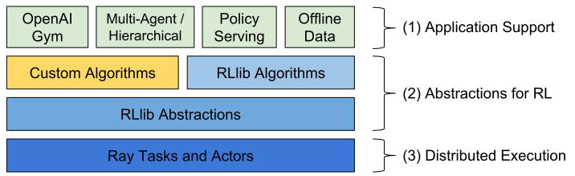

# Berkeley Ray与原生Python的对比
随着机器学习算法的迅速发展，越来越多的机器学习应用程序需要多台机器来进行并行计算以此来加快速度。但是，在集群上进行机器学习的基础设施仍然是一次性的。虽然确实存在针对特定用例（例如，参数服务器或超参数搜索）和AI之外的高质量分布式系统的良好解决方案（例如，Hadoop或Spark），但是开发前沿算法的人员通常从头开始构建他们自己的系统基础结构，这需要大量多余的努力。

例如，一个概念上比较简单的算法 - 进化策略进行强化学习。该算法大约有十几行伪代码，其Python实现并不需要更多的代码。但是，在更大的机器或集群上有效地运行算法需要更多软件工程层面的工作。这涉及数千行代码，必须定义通信协议且消息序列化和反序列化策略以及各种数据处理策略。

Berkeley Ray（以下简称Ray）是一个以大规模机器学习为目标的高性能分布式计算框架。Ray通过抽象系统状态到一个全局控制存储区和保持其它所有的组件无状态来实现可扩展性和容错能力。在数据调度方面，Ray使用了分布式共享内存存储来高效地处理大规模数据，它也使用了一个从下到上的层次化调度架构去实现低延迟和高吞吐。Ray也有着基于动态任务图的轻量级接口，可以灵活地应用到各种应用上。

## 1. 用法
### 1.1. 简单的数据并行计算
我们可以导入ray，并且指定参数初始化Ray。通常来说，ray不会调度超过CPU个数的并发任务，所以我们需要指定CPU的个数或者ray自动利用`psutil.cpu_count()`计算。
```python
import ray
ray.init(num_cpus=4)
```

我们可以定义一个常规的python函数和一个ray的远程函数来看看有何不同，将常规函数转换成ray的远程函数的方法就是在函数上面加上`@ray.remote`装饰器。
```python
# 常规Python函数
def regular_function():
    return 1

# Ray远程函数
@ray.remote
def remote_function():
    return 1
```
这两个函数有这几个不同之处：

- 激活方式：常规函数激活方式是通过调用`regular_function()`，而远程函数是通过调用`remote_function.remote()`；
- 返回值：`regular_function()`是阻塞式地执行并立即返回1，但是`remote_function.remote()`非阻塞式执行且会立即返回一个Object ID，以及创建一个进程执行这个任务，而运行结果由`ray.get`阻塞式得到。

    ```python
        >>> regular_function()
        1

        >>> remote_function.remote()
        ObjectID(1c80d6937802cd7786ad25e50caf2f023c95e350)

        >>> ray.get(remote_function.remote())
        1
    ```
- 并行：`regular_function`的调用会顺序执行，而`remote_function`的调用会并行执行。

    ```python
        # 串行
        for _ in range(4):
            regular_function()
        # 并行
        for _ in range(4):
            remote_function.remote()
    ```

### 1.2. 任务依赖


有时候你在执行任务时，某个函数的输入可能是另一个函数的输出，ray通过一个任务有向图很好地解决了这个问题。

```python
@ray.remote
def f(x):
    return x

>>> x1_id = f.remote(1)
>>> ray.get(x1_id)
1

>>> y1_id = f.remote(x1_id)
>>> ray.get(y1_id)
1
```
我们可以将**Object IDs**输入到远程函数中，当实际的函数得到执行时，参数会被当作一个正常的Python对象。在这个例子中，*y1_id*的创建依赖于任务*x1_id*，只有当第一个任务执行完成后，第二个任务才会开始执行。如果在不同的计算机上执行这两个任务，则第一个任务的输出（对应于x1_id的值）将通过网络复制到调度到第二个任务的计算机。

### 1.3. 嵌套并行
Ray可以很方便的计算嵌套并行的任务，比如以下的`g()`和`h()`分别嵌套调用了`f()`的远程函数，唯一的限制就是`f()`需要在调用它的调用函数之前定义，这里需要在定义`g(),h()`之前定义。因为在定义某个远程函数的时候，这个函数会被序列化且转运到工作进程中，如果调用的远程函数`f()`还没有定义，那么定义会不完整。

```python
@ray.remote
def f():
    return 1

@ray.remote
def g():
    return [f.remote() for _ in range(4)]

@ray.remote
def h():
    return ray.get([f.remote() for _ in range(4)])

>>> ray.get(g.remote())
[ObjectID(b1457ba0911ae84989aae86f89409e953dd9a80e),
 ObjectID(7c14a1d13a56d8dc01e800761a66f09201104275),
 ObjectID(99763728ffc1a2c0766a2000ebabded52514e9a6),
 ObjectID(9c2f372e1933b04b2936bb6f58161285829b9914)]

>>> ray.get(h.remote())
[1, 1, 1, 1]
```

### 1.4. Actors
Ray的远程函数功能应该被认为是功能性和无副作用的。仅限于远程函数限制我们使用分布式函数式编程，这对于许多用例来说都很好，但实际上有点受限。Ray使用actor扩展了数据流模型。Actor本质上是一个有状态的worker（或服务）。实例化新的actor时，将创建一个新的worker，并在该特定的worker上安排actor的方法，并可以访问和改变该worker的状态。

不同的是，当我们实例化一个actor时，会创建一个全新的worker，并且在该新的actor上执行所有方法。这意味着使用单个actor时，不能实现并行，因为对actor的方法的调用将一次执行一个。但是，可以创建多个actor，并且可以并行地执行actor的方法。

```python
@ray.remote
class Example(object):
    def __init__(self, x):
        self.x = x

    def set(self, x):
        self.x = x

    def get(self):
        return self.x

e = Example.remote(1)

>>> e.set.remote(2)
 ObjectID(d966aa9b6486331dc2257522734a69ff603e5a1c)

>>> e.get.remote()
ObjectID(7c432c085864ed4c7c18cf112377a608676afbc3)

>>> ray.get(e.set.remote(2))
 None

>>> ray.get(e.get.remote())
2
```

假设我们有多个任务在同一个actor上调用方法。例如，我们可能有一个actor记录来自许多任务的执行信息。我们可以将actor句柄作为参数传递给相关任务来实现这一点。

```python
@ray.remote
class Actor(object):
    def method(self):
        pass

# 创建actor
actor = Actor.remote()

@ray.remote
def f(actor):
    # 激活actor的函数
    x_id = actor.method.remote()
    # 真正的阻塞调用返回结果
    return ray.get(x_id)

# 三个任务都会调用同一个actor的方法
f.remote(actor)
f.remote(actor)
f.remote(actor)
```

### 1.5. ray.wait
启动许多任务后，你可能想知道哪些任务已完成执行，这可以通过ray.wait完成。

```python
ready_ids, remaining_ids = ray.wait(object_ids, num_returns=1, timeout=None)
```

- 参数

    - *object_ids:* object IDs的列表；
    - *num_returns:* 要等待的最大Object IDs数。默认值为1；
    - *timeout:* 这是等待的最长时间（以毫秒为单位）。因此，ray.wait将阻塞，直到num_returns对象准备就绪或直到超时毫秒为止。

- 返回值

    - *ready_ids:* 这是对象库中可用的Object IDs列表；
    - *remaining_ids:* 这是在object_ids中但不在ready_ids中的ID列表，因此ready_ids和remaining_ids中的ID一起构成object_ids中的所有ID。

我们可以通过以下代码来执行`ray.wait`的样例，函数将返回 *(ready_list, remaining_list)* 并且这些列表中的ObjectID将按照传递给上面的`f`的参数进行排序。

```python
results = ray.wait([f.remote(i) for i in range(100)], num_results=10)
```

### 1.6. 加速序列化
将对象传递给`ray.put`函数时，该函数会使用 *Apache Arrow* 格式对对象进行序列化并将其复制到共享内存对象库中。然后，此对象将通过共享内存提供给同一台计算机上的其他worker。如果另一台机器上的worker需要它，它将会被调度器运输到另一套机器中。

```python
x = np.zeros(1000)
f.remote(x)
```

基本上等同于

```python
x = np.zeros(1000)
x_id = ray.put(x)
f.remote(x_id)
```

但是，对`ray.put`的调用会将numpy数组复制到共享内存对象存储库中，所有工作进程都可以从中读取它（无需额外复制）。而以下这段代码将会复制10份numpy对象：

```python
for i in range(10):
    f.remote(x)
```

这将会消耗更多的内存，并且花费额外的时间去复制对象，我们可以通过以下方法降低内存和时间的消耗（只复制一次）：

```python
x_id = ray.put(x)
for i in range(10):
    f.remote(x_id)
```

### 1.7. 使用GPU
除了使用CPU进行并行计算外，你也可以通过指定参数*num_gpus*来使用GPU进行计算：

```python
@ray.remote(num_gpus=1)
def f():
    ray.get_gpu_ids()

@ray.remote(num_gpus=2)
class Foo(object):
    def __init__(self):
        ray.get_gpu_ids()
```

在启动Ray的时候，我们可以传入 *num_gpus = 4* 。这将假设这台机器有4个GPU（即使它没有）。当一个任务或actor请求一个GPU时，Ray将从集合[0,1,2,3]中为其分配GPU ID。

### 1.8. 定制资源
 我们已经讨论了如何指定任务的CPU和GPU要求，但还有许多其他类型的资源。例如，任务可能需要数据集，该数据集仅存在于少数计算机上，或者可能需要在具有额外内存的计算机上进行调度，我们可以通过使用自定义资源来表达这些类型的要求。

 Ray可以使用自定义资源字典（将资源名称映射到资源数量）启动，如下所示。

 ```python
ray.init(resources={'CustomResource1': 1, 'CustomResource2': 4})
 ```

 我们也可以以类似的方式指定远程函数或actor的资源需求。
 ```python
@ray.remote(resources={'CustomResource2': 1})
def f():
    return 1
 ```

## 2. Ray相关高级库
### 2.1. Ray RLlib


Ray RLlib是一个可扩展的强化学习库，可在多个机器上运行。它可以通过样例训练脚本以及Python API使用，它目前包括以下的实现：

- A3C
- DQN
- Evolution Strategies
- PPO

### 2.2. Ray tune
Ray.tune是一个高效的分布式超参数搜索库，它提供了一个Python API，用于深度学习，强化学习和其他计算密集型任务。这是一个说明用法的玩具示例：

```python
from ray.tune import register_trainable, grid_search, run_experiments

def my_func(config, reporter):
    import time, numpy as np
    i = 0
    while True:
        reporter(timesteps_total=i, mean_accuracy=(i ** config['alpha']))
        i += config['beta']
        time.sleep(0.01)

register_trainable('my_func', my_func)

run_experiments({
    'my_experiment': {
        'run': 'my_func',
        'resources': {'cpu': 1, 'gpu': 0},
        'stop': {'mean_accuracy': 100},
        'config': {
            'alpha': grid_search([0.2, 0.4, 0.6]),
            'beta': grid_search([1, 2]),
        },
    }
})
```

## 3. 实验对比
实验环境配置：

- 系统：`Ubuntu 18.04`
- 语言：`Python3.6.7`

为了验证Ray与原生Python的性能差异，我们做了一个小实验来验证Ray是否能够真正地提高计算系统的性能。我们选择机器学习中最常用的底层算子 —— 矩阵乘法运算来做实验，原生Python函数与Ray远程函数如下：

```python
@ray.remote
def continmat_remote(power: int=100):
    if power <= 0:
        return
    m: np.ndarray = np.random.randn(1000, 1000)
    for _ in range(power):
        np.matmul(m, m)


def continmat(power: int=100):
    if power <= 0:
        return
    m: np.ndarray = np.random.randn(1000, 1000)
    for _ in range(power):
        np.matmul(m, m)
```

这两个函数都是随机初始化一个1000维的方阵，然后再对这个方阵求100次幂。我们分别记录这两个函数重复迭代`count`次所需要的时间：

```python
def cmptest(count: int):
    if count < 1:
        return
    # naive python
    np_results = [[], []]
    for epoch in range(1, count):
        start: datetime = datetime.now()
        for j in range(epoch):
            continmat()
        np_results[0].append(epoch)
        np_results[1].append((datetime.now() - start).seconds)
    # berkeley ray
    ray_results= [[], []]
    for epoch in range(1, count):
        start: datetime = datetime.now()
        task_ids = []
        for j in range(epoch):
            task_ids.append(continmat_remote.remote())
        for task_id in task_ids:
            ray.get(task_id)
        ray_results[0].append(epoch)
        ray_results[1].append((datetime.now() - start).seconds)
    return np_results, ray_results
```

我们使用单台设备(CPU核心数为4)进行计算，最终可视化这两个函数的耗时得到的结果如下：


通过上图我们可以发现，Ray充分利用了多核CPU的威力。当迭代次数不断增大时，总体上来讲Ray所需要的时间比原生Python更低。但是我们也注意到，在迭代次数比较低时，Ray所消耗的时间与原生Python差不多甚至略有超过，这可能是因为Ray的任务调度机制以及初始化需要占据一定的时间。总的来说，Ray非常适合任务数更多以及耗时更大的计算项目。


## 4. 参考文献
- [1] [Ray: A Distributed Framework for Emerging AI Applications](https://arxiv.org/abs/1712.05889)
- [2] [https://rise.cs.berkeley.edu/projects/ray/](https://rise.cs.berkeley.edu/projects/ray/)
- [3] [https://github.com/ray-project/ray](https://github.com/ray-project/ray)
- [4] [https://bair.berkeley.edu/blog/2018/01/09/ray/](https://bair.berkeley.edu/blog/2018/01/09/ray/)
- [5] [https://github.com/ray-project/tutorial](https://github.com/ray-project/tutorial)
- [6] [https://www.datanami.com/2017/03/28/meet-ray-real-time-machine-learning-replacement-spark/](https://www.datanami.com/2017/03/28/meet-ray-real-time-machine-learning-replacement-spark/)
- [7] [https://towardsdatascience.com/september-7-and-8-2017-marked-the-first-ever-risecamp-at-uc-berkeley-499df29267af](https://towardsdatascience.com/september-7-and-8-2017-marked-the-first-ever-risecamp-at-uc-berkeley-499df29267af)
- [8] [https://arrow.apache.org/](https://arrow.apache.org/)
- [9] [https://ray.readthedocs.io/en/latest/](https://ray.readthedocs.io/en/latest/)
