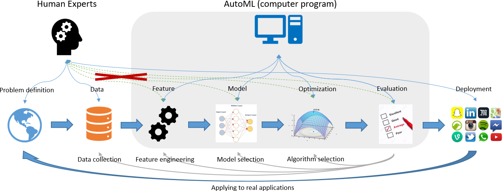
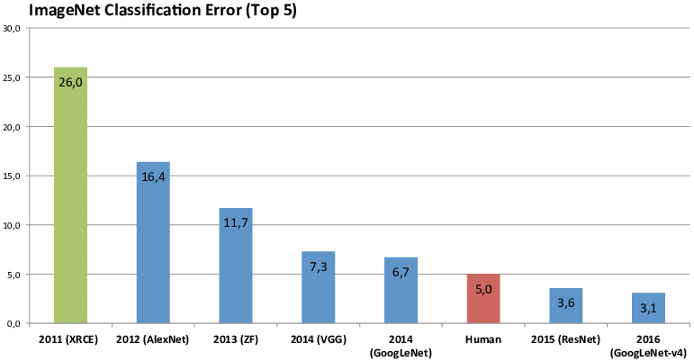
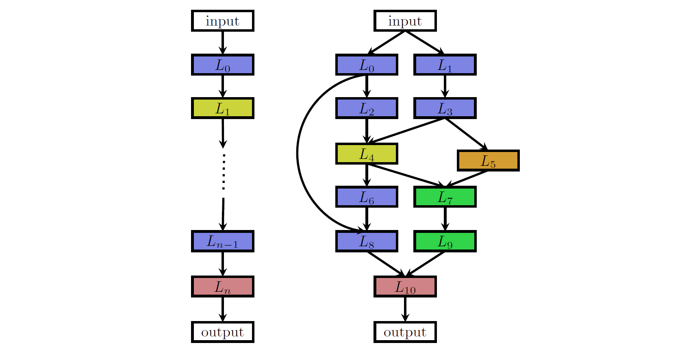

# 自动机器学习中的架构设计
随着机器学习方法尤其是深度学习在各个领域的广泛应用，算法与模型架构设计的需求与日俱争。然而这需要熟练的机器学习工程师不断地试错才能得到一个性能较好的模型，并且熟练机器学习工程师的数量也无法与庞大的需求相匹配。自动机器学习尤其是神经构架搜索技术旨在解决这一难题，将机器学习工程师从这一枯燥乏味的工作中解脱出来。与传统软件体系架构设计的思路不同，神经架构搜索在一定程度上将模型架构设计的权力交给机器，让机器自动去设计并评估模型的好坏。本文主要介绍神经架构搜索的起源、现状，并在一定程度上分析软件体系架构与神经架构搜索的关系。

## 1. 介绍
经典科学观在认识世界时是通过一系列不同层次的科学分支来描述基本认知，从最下层的粒子物理学依次往上粗略地可分类为化学、生物、社会学与宇宙学等。每一个层次都有自己要研究的基本模块与组合方式，粒子物理学研究不同基本粒子之间的组合方式及规律，社会学研究不同人群之间的互动及演化方式。软件体系也符合这一认知规律，在不同软件结构尺度上，我们演化出了不同的基本模块组合规律(Hofstadter et al.,1979)。操作系统把内存、磁盘以及外接设备等看作基本的模块，决定了计算机基本软硬件资源的分配，并向更高层级的抽象结构提供基本的模块。数据库、浏览器等应用层软件则利用操作系统向上提供的基本模块进行不同的组合实现了更适合应用层需求的功能。软件体系结构研究的目标正是不同的基本模块以及基本模块之间的连接组合方式，我们称之为组件（Components）和连接器（Connectors）。

随着机器学习尤其是深度学习(LeCun et al.,2015)在不同领域的广泛应用，越来越多的基本神经模块被发明用于各种各样的问题：卷积神经网络（CNN）通过模拟生物视觉机制来对二维图像进行表征学习(LeCunet al.,2010)；循环神经网络（LSTM）通过在序列的演进方向上进行递归来对序列的非线性特征进行学习(Hochreiter and Schmidhuber,1997)；Trans-former完全摒弃了传统的循环网络机制，并引入了注意力机制对序列进行建模(Vaswani et al.,2017)。种类繁多的基本神经模块给将要求解的机器学习问题增加了被解决的可能性，但是也给机器学习专家带来了繁重的体力劳动。原因在于基本模块的多样性以及每一种基本模块配置的多样性为问题建模带来了组合爆炸的问题，机器学习专家不得不花大量的时间不断地去尝试仔细设计与组合不同的基本神经组件或者是不同的神经组件配置。

虽然一方面机器学习为不同领域的棘手问题带来了曙光，但是另一方面我们又遭受着高昂的机器学习模型设计成本。最近几年，自动机器学习（AutoML）正着手解决这一繁琐枯燥的模型架构设计问题，并尝试普及机器学习到更多的人群当中，让没有机器学习经验的普通群众也能从中受益。本文主要阐述了自动机器学习与软件架构设计的基本关系，并从神经架构搜索的多方面来解释这种关系。

## 2. 自动机器学习

### 2.1. 机器学习
机器学习通常被认为是被用于高效执行某一类任务T却不需要明确指令的一类算法或者统计模型集合，它依赖于模型从过去的经验E中学习并进行模式推断某一类任务T的结果(Wikipedia contributors,2019)。机器学习的一个核心目标是模型根据给定的经验E学习数据的概率分布，然后该模型能够准确执行新的未看见过的任务样本，这中能力称之为泛化。

得益于机器学习模型尤其是深度学习模型强大的数据拟合能力或者是经验学习能力，只要拥有足够的数据以及合适的模型架构与超参数配置，模型总能够较好的拟合数据的概率分布，从而具有较好的泛化能力。本文主要探讨深度学习即神经网络与架构设计的关系，因为神经网络具有强大的泛化能力，而良好的泛化能力使得机器学习算法可以广泛应用在各种领域，比如计算机视觉、自然语言处理或者自动驾驶等。

### 2.2. 自动机器学习
如图1所示，通常一个完整的机器学习流程包含如下几个部分：1）专家定义问题并收集相关数据；2）对数据进行清洗以及特征工程（在深度学习中，特征工程通常被神经网络所取代）；3）专家进行模型架构的设计即模型选择；4）专家进行模型的训练、优化以及评估；5）将模型部署到各种各样的应用中，如终端应用或后端应用等。虽然深度学习模型具有强大的数据拟合能力，但是这种能力与模型的架构以及超参数密切相关，所以这需要经验丰富的专家对模型进行反复设计与调试才能获得一个比较好的模型。模型的调试过程通常是一个枯燥乏味的过程，并且需要机器学习专家耗费大量的时间才能有所突破。自动机器学习旨在将机器学习专家从这一过程中解放出来，目前的自动机器学习研究主要集中在以下几个方面：

#### 2.2.1. 数据处理
数据质量对于深度学习模型至关重要，良好的数据表示能够帮助神经网络学习到较好的数据表征。数据处理通常是一系列帮助后续模型更好学习到数据表征的过程，比如数据增强、维度缩减与特征编码等。在用卷积神经网络对图像进行分类的例子中，数据增强技术对于卷积神经网络是不可或缺的一个步骤。我们通过对原始图片数据的旋转、裁剪等操作可以大量增加相似分布的训练数据，这能大大提高卷积神经网络的泛化性能。同样地在自然语言处理中，如果训练数据量太少，我们同样可以通过数据增强技术如同义词随机替换、随机插入等操作实现对训练数据的增强(Wei andZou,2019)。

#### 2.2.2. 超参优化
深度学习模型的优化通常是对一个包含海量参数的非凸函数进行优化，这依赖于大量的超参数设置来优化模型的泛化性能。然而在过去，由于超参组合的可能性巨大，超参数设置往往依赖于大量繁重的反复猜想验证以及以往的经验，这需要反复枯燥的体力劳动。借助自动机器学习中的贝叶斯优化以及多保真度模型评估(Hu et al.,2019)等技术，超参优化可以减少大量的人力时间去调整模型的超参数就可以获得较好的参数配置，并且这提高了科学研究中模型的可再现性以及公平性。

#### 2.2.3. 神经架构搜索
本文主要阐述自动机器学习中的神经架构搜索，因此本小节的内容将会在第3节重点阐述。

### 2.3. 架构要素
软件架构通常会遵循几个约束，如利益相关方、技术环境以及架构师的经验，这几部分会影响软件架构的设计(Wikipedia contributors,2019)。同样地，神经架构搜索技术也受这几个约束的影响。首先，自动机器学习技术的出现是为了帮助机器学习专家摆脱大量枯燥乏味的模型调参、模型设计等过程，因此该技术应该让整个模型设计与训练的过程自动化，并且对于用户来说需尽可能降低成本与提高模型效果。其次，自动机器学习技术应受限于当前技术的发展，比如现在的神经架构搜索多仅限于小数据集上的卷积神经网络架构搜索，对于大型的自然语言处理模型还无能为力，如BERT (Devlin et al.,2018)、GPT2 (Radford et al.,2019)等。最后是架构师的经验，架构师的经验对于神经架构搜索至关重要。以卷积神经网络为例，架构师如果对经典的卷积网络架构不熟悉，那么架构师将会挑选出不合适的基本组件，这将会严重影响模型最后的效果。

## 3. 神经架构搜索
传统的神经网络架构需要机器学习专家仔细挑选每一个神经基本模块来进行组合设计，由于神经网络的数据拟合能力与神经网络架构息息相关，所以这通常需要耗费大量的时间来进行试错。神经构架搜索（NAS）尝试着将这一设计过程自动化，它通过仔细挑选基本模块或者组件，然后将这些基本模块按照一定的策略（Search Strategy）进行组合排列之后得到一系列新的模型架构，我们称这些新模型架构的集合为搜索空间（Search Space），该系统会对搜索空间的每个模型架构按照预先设置好的评价方法对模型进行评估（Performance Estimation Strategy），最后从中挑选出评估最好的模型。神经架构搜索帮助机器学习专家摆脱了枯燥乏味的模型设计试错过程，而且在一定程度上穷举了所有可能的神经网络模型架构，从而设计出更好的模型架构。

目前的神经架构搜索尚处于初步的研究阶段，所以大部分研究都集中在对更为成熟的卷积神经网络模型架构的搜索。在本节中，我们首先会介绍经典的卷积神经网络架构演变历史，从而更好地把握神经架构的搜索思路；其次会介绍一些基本模块的设计方法，好的基本模块能帮助我们设计出更好的神经网络架构；最后是介绍一些主流的架构搜索方法，这些方法能够加快模型架构的搜索过程。

### 3.1. 经典CNN架构演变

LeNet5(LeCun et al.)是早期出现的经典卷积神经网络之一。LeNet5架构是建立在图像特征是高度空间相关的假设上，它证明了基于可学习参数的卷积是使用更少参数提取多个位置上相似特征的有效方法。该网络使用了三层序列的叠加：卷积提取空间特征、使用池化进行降采样、使用tanh或者sigmoid作为非线性激活函数，并使用全连接网络（MLP）作为最终的分类器。

ImageNet(Deng et al.,2009)是由斯坦福科学家李飞飞所领导的小组所建立的一个开源图像数据集，它采用了WordNet (Fellbaum,1998)的层次化结构来组织图像数据集。自2010年起，ImageNet项目每年举行一场大规模视觉识别挑战赛（ILSVRC），该挑战赛旨在提高程序分类检测的效果。2012年，AlexNet(Krizhevsky et al.,2012)首次使用了卷积神经网络并在该挑战赛上获得了巨大成功，从此开启了卷积神经网络在图像分类检测的热潮（参考图2）。AlexNet可以说是LeNet更深、更广的版本，它的贡献在于：1）使用ReLU作为激活函数；2）使用dropout技术选择性的忽略训练中的单个神经元，避免模型的过拟合；3）使用重叠最大池化，避免了平均池化的平均效应；4）使用NVIDIA GTX 580GPU减少训练时间。

VGG(Simonyan and Zisserman,2014)在ImageNet 2014的分类挑战赛中获得了第二名的成绩。它率先在卷积核中使用了更小的3×3过滤器，这与AlexNet的9×9或11×11过滤器截然不同，因为VGG发现多个3×3的卷积序列可以模拟更大、更具容忍性的结构。GoogLeNet(Szegedyet al.,2015)在ImageNet 2014的分类挑战赛中获得了第一名的成绩，该模型提出了Inception模块，并显著减轻了计算负担。Inception模块是1×1，3×3，5×5卷积过滤器的并行组合，最大的创新点在于它在昂贵的并行计算之前使用1×1卷积块减少特征的数量。

ResNet(He et al.,2016)赢得了ImageNet 2015分类挑战赛的冠军，该模型将网络深度提高到了惊人的152层。之前的卷积神经网络层数一般都比较浅，原因在于网络模型做深之后会出现梯度消失或者梯度爆炸的问题。ResNet的创新点在于将两个连续的卷积层输出加上跳过这两层的输入传给下一层，这称之为残差连接。

### 3.2. 基本模块及其组合方式
受到经典卷积神经网络架构演变的启发，神经架构搜索技术基于此精心挑选并设计了一些基本的模块或组件。

#### 3.2.1. 全局

在卷积神经网络架构的搜索中，全局搜索以基本的神经模块作为基本组件，比如根据过滤器、卷积核尺寸以及步长的不同设置不同的卷积块、不同类型的池化块或者全连接块等。如图3所示，图中左边的架构是一个相对比较简单的链式神经网络架构。链式架构采用了n个不同的基本模块L组合并简单连接在一起，每个模块可由上述的神经网络基本组件进行填充，整个神经网络模型架构可表示为A=Ln◦:::◦L1◦L0。图中右边的架构是一个更为复杂的多分支架构，该架构不仅使用了上述神经基本模块作为组合的组件，还使用了更为复杂的跳跃连接（skip connections）。跳跃连接与ResNet的残差连接有异曲同工之妙，它能够帮助搜索到更为复杂、更深的神经网络架构。

基于最小的基本神经模块进行组合在一定程度上把机器学习工程师从枯燥的试错中解放出来，然而实践表明由于可组合的模块太多，这种组合搜索会带来搜索空间爆炸的问题。组合爆炸的代价是我们不仅需要大量昂贵的机器进行分布式运算，而且还需要以天为单位的计算时间才能搜索出一个比较好的模型。这在实际生产环境中不能够满足用户的需求，时间和金钱上的成本都比较高。基于细胞或者块的搜索在一定程度上改善了这个问题。

#### 3.2.2. 基于细胞

受到由重复图案组成的建筑的启发，Zoph et al.和Zhong et al.提出了基于细胞或者块的组合方法（以下统称为细胞）。细胞是指由上述基于全局搜索的基本组件拼接而成的更大的组件，基于细胞的神经架构搜索通过简单的堆叠细胞来达到更快搜索较好架构的效果，并且训练好的细胞可以进行方便的迁移学习。如图4左所示，基于细胞的神经架构搜索一般会选择两种基本的细胞组件。第一个是正常细胞（normal cell），正常细胞由不同的卷积块、池化块等组成，输入输出保持相同的维度。第二个是缩减细胞（reduction cell），该细胞组成部分大体与前者相同，但是细胞的输出维度会比输入维度低即具有降维功能。

### 3.3. 优化方法
尽管神经架构搜索方法从基于全局的搜索演变到基于细胞的搜索，但是搜索所需要耗费的时间和算力仍然是惊人的。为了解决这些问题，许多不同的策略被用于优化搜索过程，比如随机搜索、贝叶斯优化、进化算法、强化学习和基于梯度的方法等。本节将会简单介绍两种主流的优化方法。

#### 3.3.1. 强化学习
强化学习方法非常适合用于智能体在与环境进行交互时对一系列决策过程进行建模，智能体会从一系列与环境交互的片段中学着改善它的行为以获得最大的长期收益。在智能体与环境交互的每一步中，一方面智能体会执行一个动作并接收到状态和奖励，另一方面环境会接收到智能体的动作并转移新的状态和发出对应的观察和奖励。

神经架构搜索问题与强化学习非常类似，它可以被抽象成一个强化学习问题。神经网络架构的生成可以被看做是智能体的动作，动作空间对应着搜索空间，而智能体动作的奖励则是基于对神经网络架构性能的评估，如准确率、内存消耗等指标。在神经架构搜索优化问题中，不同的强化学习方法有不同的动作策略，智能体策略控制器通常采用循环神经网络（RNN）来生成网络架构序列，生成器最终将会把这个序列编码成一个新的神经网络架构。

#### 3.3.2. 启发式
启发式优化方法的灵感来源于生物的行为，大部分该类方法都是基于种群的优化方法，比如粒子群算法（PSO）、进化算法等。在神经架构搜索的优化问题中，大部分模型采用的是进化算法。进化算法有以下几个基本的部分构成：初始化、父代选择、重组和突变、幸存者选择。初始化会定义好如何生成第一代种群，等到第一代种群初始化后（一批神经网络架构被初始化），优化器会不断重复以下过程直到满足优化指标：

- 从种群中选择父代以进行繁殖；
- 应用重组和突变操作来创造新的个体即新的神经网络架构（保证多样化和相似性的平衡）；
- 评估新个体的存活度即评估模型性能表现；
- 选择这一代的幸存者即选择性能表现好的神经网络架构；

## 4. 总结
不同于传统的软件体系架构设计方法，神经架构搜索的一系列方法将架构设计的权力交给了机器，让机器自动设计架构并测试架构的性能。这种方法在一定程度上缓解了枯燥乏味的人工架构设计过程，为机器学习社区架构设计带来了新的曙光。但是我们也注意到，这种架构设计方法有很大的局限性，比如算力消耗过于巨大，自动架构搜索还仅限于一些已经十分成熟的模块。虽然自动机器学习还处于婴儿时期，但是它的价值将会是十分巨大的，我相信未来将会有更多关于这个领域激动人心的工作。

## 5. 参考文献
- J. Deng, W. Dong, R. Socher, L.-J. Li, K. Li, and L. Fei-Fei. ImageNet: ALarge-Scale Hierarchical Image Database. InCVPR09, 2009.
- J. Devlin, M.-W. Chang, K. Lee, and K. Toutanova. Bert: Pre-training ofdeep bidirectional transformers for language understanding. InNAACL-HLT, 2018.C. Fellbaum.WordNet: An Electronic Lexical Database. Bradford Books,1998.
- K. He, X. Zhang, S. Ren, and J. Sun.  Deep residual learning for im-age recognition.2016 IEEE Conference on Computer Vision and Pat-tern Recognition (CVPR), Jun 2016. doi: 10.1109/cvpr.2016.90. URLhttp://dx.doi.org/10.1109/CVPR.2016.90.
- S.Hochreiter and J. Schmidhuber. Long short-term memory.Neural com-putation, 9(8):1735–1780, 1997.
- D. R. Hofstadter et al.Gödel, Escher, Bach: an eternal golden braid, vol-ume 20. Basic books New York, 1979.
- Y.-Q. Hu, Y. Yu, W.-W. Tu, Q. Yang, Y. Chen, and W. Dai. Multi-fidelityautomatic hyper-parameter tuning via transfer series expansion. InAAAI2019, 2019.
- F. Hutter, L. Kotthoff, and J. Vanschoren, editors.Automated MachineLearning: Methods, Systems, Challenges. Springer, 2018. In press, avail-able at http://automl.org/book.
- A. Krizhevsky, I. Sutskever, and G. E. Hinton.  Imagenet classificationwith deep convolutional neural networks.  In F. Pereira, C. J. C.Burges, L. Bottou, and K. Q. Weinberger, editors,Advances inNeural Information Processing Systems 25, pages 1097–1105. Cur-ran Associates, Inc., 2012.  URLhttp://papers.nips.cc/paper/4824-imagenet-classification-with-deep-convolutional-neural-networks.pdf.
- Y. LeCun, K. Kavukcuoglu, and C. Farabet. Convolutional networks andapplications in vision.Proceedings of 2010 IEEE International Symposiumon Circuits and Systems, pages 253–256, 2010.
- Y. LeCun, Y. Bengio, and G. Hinton. Deep learning.Nature, 521(7553):436–444, 5 2015. ISSN 0028-0836. doi: 10.1038/nature14539.
- Y. LeCun et al. Lenet-5, convolutional neural networks.
- A. Radford, J. Wu, R. Child, D. Luan, D. Amodei, and I. Sutskever. Lan-guage models are unsupervised multitask learners. 2019.K. Simonyan and A. Zisserman. Very deep convolutional networks for large-scale image recognition, 2014.
- C. Szegedy, W. Liu, Y. Jia, P. Sermanet, S. Reed, D. Anguelov, D. Erhan,V. Vanhoucke, and A. Rabinovich. Going deeper with convolutions.2015IEEE Conference on Computer Vision and Pattern Recognition (CVPR),Jun 2015. doi: 10.1109/cvpr.2015.7298594. URLhttp://dx.doi.org/10.1109/CVPR.2015.7298594.
- A. Vaswani, N. Shazeer, N. Parmar, J. Uszkoreit, L. Jones, A. N. Gomez,Ł. Kaiser, and I. Polosukhin. Attention is all you need. InAdvances inneural information processing systems, pages 5998–6008, 2017.
- G. von Zitzewitz. Survey of neural networks in autonomous driving. 07 2017.
- J. W. Wei and K. Zou. Eda: Easy data augmentation techniques for boostingperformance on text classification tasks, 2019.
- Wikipedia contributors.  Machine learning — Wikipedia, the free ency-clopedia, 2019. URLhttps://en.wikipedia.org/w/index.php?title=Machine_learning&oldid=900937669. [Online; accessed 11-June-2019].
- Q. Yao, M. Wang, H. J. Escalante, I. Guyon, Y.-Q. Hu, Y.-F. Li, W.-W. Tu,Q. Yang, and Y. Yu. Taking human out of learning applications: A surveyon automated machine learning.CoRR, abs/1810.13306, 2018.
- Z. Zhong, J. Yan, W. Wu, J. Shao, and C.-L. Liu. Practical block-wiseneural network architecture generation.2018 IEEE/CVF Conference onComputer Vision and Pattern Recognition, pages 2423–2432, 2018.
- B. Zoph, V. Vasudevan, J. Shlens, and Q. V. Le. Learning transferablearchitectures for scalable image recognition.2018 IEEE/CVF Conferenceon Computer Vision and Pattern Recognition, pages 8697–8710, 2018.