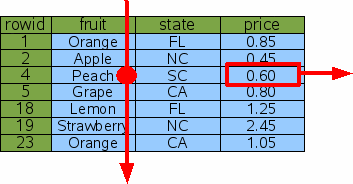
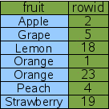
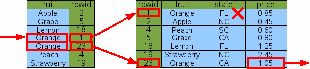
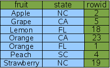
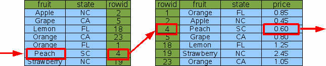
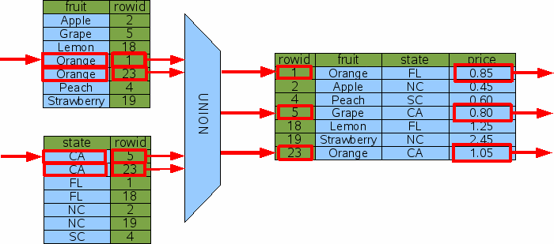
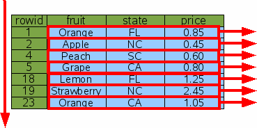
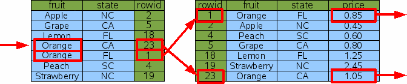

# SQLite3查询器的工作原理
本文提供了一些关于`query planner`如何工作的相关信息，我们可以利用这些信息来创造更好的索引去帮助`query planner`工作得更好。

## 目录
- [SQLite3查询器的工作原理](#sqlite3查询器的工作原理)
  - [目录](#目录)
  - [1 搜索](#1-搜索)
    - [1.1 带有索引的表](#11-带有索引的表)
    - [1.2 通过列编号（`Rowid`）查询](#12-通过列编号rowid查询)
    - [1.3 通过索引（`index`）查询](#13-通过索引index查询)
    - [1.4 多行结果](#14-多行结果)
    - [1.5 多个`And`连接的条件语句](#15-多个and连接的条件语句)
    - [1.6 多列索引](#16-多列索引)
    - [1.7 全索引](#17-全索引)
    - [1.8 `Or`连接的条件语句](#18-or连接的条件语句)
  - [2 排序](#2-排序)
    - [2.1 通过列编号（`Rowid`）排序](#21-通过列编号rowid排序)
    - [2.2 通过索引（`index`）排序](#22-通过索引index排序)
    - [2.3 通过全索引排序](#23-通过全索引排序)
  - [3 同时搜索和排序](#3-同时搜索和排序)
    - [3.1 通过多列的索引进行搜索和排序](#31-通过多列的索引进行搜索和排序)
    - [3.2 通过全索引搜索和排序](#32-通过全索引搜索和排序)
    - [3.3 使用一个索引部分排序（例如块排序）](#33-使用一个索引部分排序例如块排序)
  - [4 没有列编号（`Rowid`）的表](#4-没有列编号rowid的表)

声明式而不是过程式语言是SQL最好的特性，这对于所有版本的SQL引擎都是一样的，不仅仅是SQLite。当我们在编写SQL时，我们只是在告诉系统我们想要系统进行的计算，而不是如何去计算它。至于如何适当地执行SQL语句这个任务，只需要将它交给SQL数据库引擎的子系统`query planner`完成即可。

对于任何的SQL语句，可能有成百上千种算法去执行这个操作，尽管某些算法速度可能会快一点，但是所有的这些算法都会得到正确的答案。而`query planner`在这个过程中就是一个扮演着尝试着挑选出最快、最有效算法的`AI`程序。

在大部分时间，SQLite中的子引擎`query planner`都工作得非常好，但是，它工作好的前提是需要程序员提前添加一些索引，这样，`query planner`才能根据这些索引做出一个最优决策。

## 1 搜索
### 1.1 带有索引的表
在SQLite中，大部分表都有零行或者多行的唯一整型键（`rowid`或者`INTEGER PRIMARY KEY`）组成，每一行都按照递增`rowid`顺序逻辑存储。本文以一个名为`FruitsForSale`的表为例子，它存储了各种水果的种植地以及在市场中的单价，整个表结构SQL如下：

```sql
CREATE TABLE FruitsForSale(
  Fruit TEXT,
  State TEXT,
  Price REAL
);
```

往表中插入任意的数据，表在硬盘中逻辑存储的结构如下图所示：


在这个例子中，`rowid`并不是连续的，但是是有序的。通常，`rowid`是以1开始，并且随着记录每增加一行，`rowid`也会自动加1。但是，如果某一行被删除，在这个序列中就会产生一些不连续的记录。如果你愿意，应用程序也可以控制`rowid`的分配，所以新插入的行不必总是分配到最后一行。总的来说，不管怎样，`rowid`总是唯一的并且是严格按照递增的顺序来分配的。

假设你想在表中查找桃子的价格，查询语句可能看起来是如下这个样子：

```sql
SELECT price FROM fruitsforsale WHERE fruit='Peach';
```

为了完成这个查询，SQLite会从第一行依次读每条记录，同时检查`fruit`列的值是否是桃子(peach)，如果是则输出价格，整个查询的过程可由如下的图2描述。这个扫描算法叫作`全表扫描`，因为在搜索的过程中，为了找到某一行的目标值整个表的内容都会被读和检查一遍。在一个仅仅只有7行的表里，这个操作是可以接受的，但是如果表包含了七百万条数据，为了找到一个8字节的数字，`全表扫描`可能会为此读上兆字节的数据。所以通常情况下，我们应该尽力避免`全表扫描`。



### 1.2 通过列编号（`Rowid`）查询
避免`全表扫描`的技巧之一就是通过`rowid`（或者`INTEGER PRIMARY KEY`）查找。为了找到桃子的价格，我们可以通过`rowid = 4`来编写SQL语句：

```sql
SELECT price FROM fruitsforsale WHERE rowid=4;
```

因为所有数据记录是按照`rowid`的顺序存储在表中，所以SQLite能够通过`二分查找`很快找到正确的一行。如果整个表含有`N`条记录，那么查找指定行的时间可以缩减到`logN`而不是像`全表扫描`那样需要`N`次扫描。如果表包含1000w条数据，那么查询将会快100w倍（`N/logN`）。


### 1.3 通过索引（`index`）查询
但是按照`rowid`查找数据记录的真正问题是你可能并不关心`rowid = 4`这条记录的价格是多少，你关心的是桃子的价格是多少，也就是说你在按照`rowid`查找信息之前，你可能并不知道桃子的`rowid`是什么，所以按照`rowid`查找数据记录可能无法实现。

为了使得按照`rowid`查找数据记录变得更有效，我们可以为表`fruitsforsale`的`fruit`这一列单独添加一个索引，就像这个样子：

```sql
CREATE INDEX Idx1 ON fruitsforsale(fruit);
```

索引是另一种类似于`fruitsforsale`的表，但它的内容（在本例中为列`fruit`）是存储在`rowid`前面，而且所有的行都是以内容来进行排序的。如下图4展示了`Idx1`的逻辑视图，`fruit`列作为主键来对整个表进行排序，而`rowid`是第二个键用于打破主键相等时的排序。在本例中，主键中有两个`Orange`，而`rowid`就是用于打破它们的平衡，以此达到排序的目的，因为`rowid`是始终唯一的，所以，`fruit + rowid`的组合在整个索引中是唯一的。



新的索引表可以被用来实现一个更快的算法来查找桃子价格：

```sql
SELECT price FROM fruitsforsale WHERE fruit='Peach';
```

因为在索引表`Idx1`中所有数据记录都是按照`fruit`来进行排序的，所以我们可以通过在索引表上对`fruit`列做二分查找，从而找到`fruit = 'Peach'`记录的`rowid`。等到我们找到`rowid`之后，我们可以再在`fruitsforsale`上做一个二分查找通过第一查找找到的`rowid`值。这样如下图5所示，我们就可以通过两次二分查找找到桃子的价格。


在这个例子中，SQLite做了两次二分查找才找到了桃子的价格，但是在存储有大量数据的表中，两次二分查找的速度仍然远远快于`全表扫描`。

### 1.4 多行结果
在之前查找`fruit='Peach'`的过程中，我们将结果范围缩减至单行，但是如果我们的查询结果是多行，这种技巧是仍然有效的。假设我们现在要查找橘子：

```sql
SELECT price FROM fruitsforsale WHERE fruit='Orange';
```


在这个例子中，SQLite仍然通过一次二分查找找到第一个匹配`fruit='Orange'`的数据记录，然后它利用找到的`rowid`在原始表中通过二分查找找到橘子的价格并输出。但是此时数据库引擎并没有中止，它会转移到索引表的下一行做同样的匹配判断`fruit='Orange'`，移到下一行操作所花费的时间远远小于做一次二分搜索的时间，因为下一行与当前行数据经常位于同一数据库页。事实上，移到下一行操作所花费的时间是非常小的，以至于我们可以忽略不计，所以我们这个查找所花费的时间实际上大约是三次二分搜索。假设查找需要输出行的个数为`K`，表的总行数为`N`，那么做一次查询通常的时间花费为`(K + 1)*logN`。

### 1.5 多个`And`连接的条件语句
另一个例子，加入你想查找的不仅仅是橘子的价格，而且是加州生产橘子的价格，查询的SQL语句可能如下所示：

```sql
SELECT price FROM fruitsforsale WHERE fruit='Orange' AND state='CA';
```



一个方法是先通过索引`Idx1`查找所有橘子的`rowid`，然后再在原始表进行二分查找的时候过滤掉不是在加州生产的橘子，这样就得到了所有加州生产橘子的价格，这种算法的查找过程如上图7所示。这种算法在大多数情况下是合理的，但是它会做一些额外的二分查找来找到佛罗里达州的橘子，并在之后把它过滤掉，因此这种算法不是我们所希望的一种理想的算法。

假设我们额外再为列`State`添加一个索引：

```sql
CREATE INDEX Idx2 ON fruitsforsale(state);
```


使用新的`Idx2`索引，我们找到加州生产的橘子价格：


虽然使用索引`Idx2`导致SQLite获得了不同的列数据集，但是最终却得到了相同的结果（这是非常重要的，索引并不会改变答案，而是帮助引擎更快地搜索到结果），与此同时使用索引`Idx2`与使用索引`Idx1`做了同样多的工作量，它并没有帮助提高性能。

在我们的例子中，最后两次查询花了同样多的时间，所以最终引擎会选择哪一个索引呢？如果我们使用`ANALYZE`命令对数据库进行分析，数据库会统计可用的索引数据，然后数据库会知道`Idx1`一般会将搜索范围缩减至一行（除开本例`fruit='Orange'`）而`Idx2`一般会将搜索结果缩减至两行。所以，如果其它的所有都相等，为了尽可能减少搜索出的数据集数量，数据库会优先选择索引`Idx1`。之所以会有这种结果，是因为这种结果是`ANALYZE`命令分析得出的，如果没有这个命令，索引的选择将会是另一种情况。

### 1.6 多列索引
为了在`AND`连接的多列条件SQL查询语句中获得最大的性能，我们会创建一个多列的索引：

```sql
CREATE INDEX Idx3 ON FruitsForSale(fruit, state);
```



多列索引与单列索引遵循相同的规则，索引的列将会被放在`rowid`之前。唯一的区别就是现在有多列被添加为索引，最左边的一列作为主键对索引表进行排序，而第二列则是用于打破最左边列数据相等时的平衡。如果这里有第三列索引，那么同样地，第三列将会用于打破第二列数据相等时的平衡。因此对于索引中的所有数据行来说，因为`rowid`保证是唯一的，即便是索引表中两列索引数据所有都是一样的，索引表中的每一行数据也是唯一的。在我们的样例中，`fruit='Orange'`在第一列索引中会出现数据相等的情况，但这种情况不会持续太久，因为它会被第二列的数据打破僵局。

通过使用新的索引`Idx3`，我们可以通过两次二分查找就找到加州生长橘子的价格:

```sql
SELECT price FROM fruitsforsale WHERE fruit='Orange' AND state='CA';
```


在上面`AND`连接限制的SQL语句中，SQLite仅仅只需要做一次二分查找就可以找到加州生长橘子的`rowid`，然后在原始表中再做一次二分查找找到橘子的价格。在这个查找过程中，这里不需要更多的二分查找即可完成此次查询。

这里我们注意到索引`Idx3`也包含索引`Idx1`的所有信息，所以此时我么已经不需要`Idx1`了，查找桃子的价格也可以通过忽略索引表`Idx3`中`State`列即可进行查找：

```sql
SELECT price FROM fruitsforsale WHERE fruit='Peach';
```



因此，我们可以从此处看出一个好的数据库设计规则是`不应该包含这样两个索引，其中一个索引是另一个索引的前缀`。所以，删除带有更少列的索引，SQLite仍然会通过更长列的索引进行高效地查询工作。

### 1.7 全索引
查找加州生长橘子的价格通过两列索引已经足够高效了，但是我们可以通过创建一个三列索引来做得更好：

```sql
CREATE INDEX Idx4 ON FruitsForSale(fruit, state, price);
```


这个索引表包含了原始表`FruitsForSale`的所有列，包括了`所有搜索项`和`rowid`，我们称之为`全索引`。因为所有的信息都包括在全索引中，所以SQLite不需要查询原始表就可以找到橘子价格。


因此，通过在索引中添加额外的`输出列`能够避免在原始表中再查询一次，而且能够将二分查找的次数减半。这是一个常数级的性能提升（粗略地将速度提升一倍）。但是从另一方面来讲，它仅仅是一次小的修正。当表第一次建立索引时，两倍的性能提升对于之前100w倍的提升还不够明显。对于大多数的查询，查询1和查询2之前的毫秒级的差别通常都不会被注意到。

### 1.8 `Or`连接的条件语句
多列的索引仅仅是当`WHERE`限制语句中是`AND`连接的时候才会起作用，所以当我们查找`要么在加州生长要么是橘子`时，`Idx3`和`Idx4`或许对我们有用：

```sql
SELECT price FROM FruitsForSale WHERE fruit='Orange' OR state='CA';
```

当面临`OR`连接的SQL语句时，SQLite会检查每一个`OR`连接的条件，然后单独通过一个索引找出对应条件的`rowid`，之后，数据库引擎再将所有结果求交集，最后得到的`rowid`就是所查找数据记录的`rowid`，整个查找流程如下图所示：



以上操作流程显示了SQLite会事先计算好所有`rowid`，然后再将其求交集，最终才到原始表中进行查找。在实际情况中，`rowid`的查找伴随着`rowid`的计算，SQLite在利用索引查找`rowid`的同时也会记住哪些列之前已经查找过，以此来避免重复的查找。这是SQLite引擎实现的细节，所以这张图并不是100%准确描述了查找过程。

为了帮助`OR - UNION`这种技巧变得有效，每一个`OR`连接的列都必须有其对应的索引。即使是只有其中一个项没有索引，那么数据库引擎也不得不对其进行`全表扫描`，如果SQLite做了`全表扫描`，它可能在原始表中只做一次全表扫描即可，而没有`UNION`操作和之后的二分搜索。

我们也可以看到SQLite利用`OR-BY-UNION`技巧在多个索引上针对包含`AND`连接条件的查询进行优化通过使用内连接的操作。很多SQL数据库引擎也实现了相同的操作，但是使用单个索引获得的性能提升是很小的，所以SQLite没有完成这一个技巧。

## 2 排序
正如其它SQL数据库引擎一样，SQLite也能在查询中通过索引来加速完成从句中的`ORDER BY`功能，也就是排序功能。当没有合适的索引时，一个带着排序的查询语句可能是分这几个步骤完成的。考虑以下这个查询：

```sql
SELECT * FROM fruitsforsale ORDER BY fruit;
```

SQLite在处理这个查询的时候是将所有的输出先查询出来，然后再单独通过一个排序器对其进行排序。


如果查询结果的行数是`K`，那么排序所需要花费的时间一般是`KlogK`。如果`K`非常小，那么排序所花费的时间不会有很大的影响，但是假设有这么一种情况`K == N`，那么排序所花费的时间会远远超过`全表扫描`。而且，整个输出数据会累积到缓冲区中（一般为主存或者硬盘，依赖于编译时间和运行时设置），这意味着将需要大量额外的缓冲区存储来完成这个查询。

### 2.1 通过列编号（`Rowid`）排序
正是因为排序的成本代价非常高，所以SQLite倾向于把排序操作转换成无操作。如果SQLite可以把输出自然地变成某一特定的顺序，那么我们将不需要排序操作。举一个例子，如果我们要求输出的顺序是按照`rowid`来排序的，那么这里将不会有排序操作发生：

```sql
SELECT * FROM fruitsforsale ORDER BY rowid;
```



我们也可以像下面这样要求降序排列：

```sql
SELECT * FROM fruitsforsale ORDER BY rowid DESC;
```

SQLite仍然会忽略排序这一步，但是为了按照指定的顺序输出，数据库会从表的最后往前扫描。

### 2.2 通过索引（`index`）排序
当然，按照`rowid`来排序是很少用到的。通常我们会想要通过其它的列进行排序。

如果我们想要通过某一列进行排序，而恰巧这一列已经有了对应的索引，那么这一个索引就可以被用来排序。考虑如下对`fruit`进行排序的SQL语句：

```sql
SELECT * FROM fruitsforsale ORDER BY fruit;
```


为了找出按照`fruit`顺序排序的每一行`rowid`，我们可以通过从上到下扫描`Idx1`（或者从下到上，如果SQL语句是`ORDER BY fruit DESC`）。然后，对于每一个`rowid`，我们可以做一个二分搜索进行查找并输出。在这种方式中，我们在找到对应的数据后就不必再对其单独进行排序，因为我们得到的数据就是按照`fruit`排好序输出的。

但是这种方式就真的节省时间吗？我们对原始表做无索引排序的时间大致是`NlogN`，而我们使用索引`Idx1`来完成`N`次`rowid`查找，每次查找所花费的时间为`logN`，所以两者的总时间花费是一样的。

SQLite使用了一个基于`花费`的的`query planner`。当这里有两种或者更多的方式完成同样的查询时，SQLite尝试着评估每一种方法的总时间花费，然后使用时间花费最小的方式。花费一般用时间来评估，所以这种评估结果依赖于表大小和一些`WHERE`限制条件等等。但是一般来说，数据库引擎会选择索引排序，因为如果没有别的原因，索引排序是不需要额外的缓冲区存储空间。

### 2.3 通过全索引排序
如果一个全索引能够被用于查询，那么多个的原始表`rowid`查找将可以被避免，与此同时，查询所花费的时间也会急剧下降。


通过全索引，SQLite能轻易地从索引表的一头走到另一头并输出结果，花费的时间也会大致等于`N`以及不用分配别的缓冲区来装查询结果。

## 3 同时搜索和排序
之前的讨论都是搜索和排序分别进行，接下来，我们将会讨论在同一个查询中，查询和排序同时存在，幸运地是，我们可以通过一个索引做到同时搜索和排序。

### 3.1 通过多列的索引进行搜索和排序
假设我们想要以生长地为顺序找到所有橘子的价格，查询语句如下：

```sql
SELECT price FROM fruitforsale WHERE fruit='Orange' ORDER BY state;
```

这个查询既包含了一个搜索限制也包含了一个排序限制，搜索和排序能够使用两列索引`Idx3`同时完成。



这个查询会通过在索引上做一次二分查找进行（`fruit='Orange'`）。因为`fruit`列是索引表最左边的列，而且所有的行都是处于有序状态，所以在索引表中找到的橘子`rowid`只需要在对应的原始表中分别进行二分查找即可得到按顺序排列的橘子价格。

我们会注意到这里没有额外的排序步骤，所以`ORDER BY`从句是变成了一个无操作从句。

### 3.2 通过全索引搜索和排序
全索引也可以用于同时搜索和排序，考虑如下这个搜索：

```sql
SELECT * FROM fruitforsale WHERE fruit='Orange' ORDER BY state;
```


正如之前的操作一样，SQLite会对索引表单独做一个二分搜索并找出满足条件的数据，然后再从找到的数据列开始从上到下找出目标数据。满足条件的数据会被保证是相邻的，因为条件从句的约束正好满足索引最左边一列。

SQLite也能够对倒叙（`descending ORDER BY`）做相同的操作：

```sql
SELECT * FROM fruitforsale WHERE fruit='Orange' ORDER BY state DESC;
```

### 3.3 使用一个索引部分排序（例如块排序）
有时，仅仅只有`ORDER BY`的一小部分能够满足索引，考虑如下一个例子：

```sql
SELECT * FROM fruitforsale ORDER BY fruit, price;
```

如果全索引被用于扫描，那么首先`fruit`列自然会出现正确的顺序，但是当那儿有两或者更多的`fruit`行相等，价格可能会无序。在这种情况下，SQLite会做很多小的排序，每一个不同水果值都要做一个小的排序，而不是一个大的排序，下图描绘了排序过程：


在这个例子中，SQLite没有单独进行一个7个元素的排序，而是分成5次一个元素的排序和1次两个元素的排序（`fruit=='Orange'`）。

把单个大排序分成小排序有如下优势：

- 1 花费更少的CPU循环
- 2 每个小排序单独进行，意味着花费更小的缓冲区存储
- 3 那些已经有序的列可以被忽略进行排序，依次来减少运行时间和存储空间
- 4 输出行可以在每一个小排序进行完之前就返回应用
- 5 如果条件从句中有其他的限制，可以避免扫描整个表

## 4 没有列编号（`Rowid`）的表
对于有`rowid`和没有`rowid`的表来说，基本的准则都是一样的，唯一的差异就是没有`rowid`的表被`PRIMARY KEY`替代。