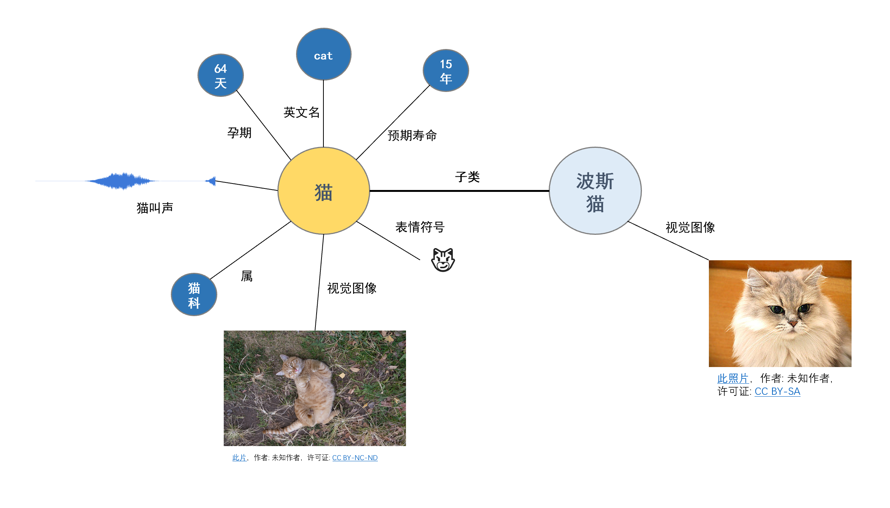

# 什么是理解
我们说理解一样事物通常是指我们把一件事物融会贯通，能够理论联合实际，可是这个融会贯通又是指的什么？

认知科学认为**理解**是一个有关于实体和人之间发生关系的过程，它的发生能够让人知道到实体的概念和实体相关的行为，并能够支持人的智能行为。例如，理解天气就意味着我们能够知晓天气相关的信息并能够预测天气的变化，理解一个人就意味着我们能够知晓这个人的相关信息并能够预测他将来的行为。

计算机科学家*Gregory Chaitin*认为理解是某种程度上的数据压缩，可看做是一种模型。他认为理解事物就意味着我们能够用一个简单的规则集合来解释它。例如，我们理解白天和夜晚的存在，因为我们有一个简单的地球自转模型能够解释海量的亮度、温度和地球气候变化等的数据。我们通过一个简单的模型将大量的数据信息压缩，并能够利用该模型准确地预测该事物的行为。

```python
    f(θ,s; x) -> y
```

这里的理解过程与机器学习模型颇有一点相似之处。机器学习先提出一个比较复杂的数据模型`f`，这个数据模型包含大量未知的参数`θ`，我们通过输入大量能够表征事物特征的数据`x`以及对应的行为`y`，这个模型就能够学习到事物的一般规则。我们输入的数据越多，模型越能够准确地预测事物的行为。

**理解**是我们获取并加工信息并有效认识世界的过程，这里的信息也被称作知识或者技能。既然要认识世界，那么势必要有合理的工具，科学就是这把工具。

根据事物尺度的不同，科学把世界看作是一个分层的世界，每一个层次都有自己独特的组件和演化规则。不同的科学处于不同的层次。量子物理目前处理人类已知最微观的层面，它研究不同的基本粒子以及它们之间的相互作用。化学则试图研究分子层面的演化规则，比如不同原子或者分子和它们之间的相互作用。生物学试图研究细胞层面的演化规则，比如不同细胞和组织以及它们之间的相互作用。同样地，经济学的基本研究对象是人，它研究人与人之间的经济关系；天体物理研究的基本对象是各种天体，它研究天体之间的关系。

这里还有其它许多学科，我无法一一列举完。但它们都有着相同的特征，每一门学科都有着基本的研究对象，它们的研究目标都是这些基本对象的内在属性以及对象之间的相互演变关系。这是我们认识理解世界最普遍的方式，这可以抽象成节点知识图网络，即知识图谱，它在一定程度上能够简单表示我们理解的世界。



如上所示，以猫的部分知识图谱为例。我们理解猫的过程就是记住（编码）与猫相关的事物的过程，我们记住猫的汉语语言符号是`猫`，猫的科属是`猫科`，猫的预期寿命是`15年`，猫的视觉图像如上图所示。我们为猫与其他事物建立的联系越多，我们就理解得越透彻，我们也能够更加准确地预测猫的行为并更好地支持我们的智能行为。

以不同人群由浅入深地理解猫为例：

- 5岁小孩子可能只知道猫的汉语符号是什么、各种不同猫的视觉图像以及猫的叫声；
- 15岁的中学生可能在此基础上了解了更多猫的信息，比如猫属于猫科动物，同属于猫科动物的还有老虎；
- 研究猫科动物的硕士可能了解猫更多的生物学信息，比如猫的预期寿命是15年，孕期是64天。

一般在以上的几个人群中来讲，我们认为研究猫科动物的硕士对猫的理解是最深的。因此，基本事物以及事物与事物之间的连接构成了我们对世界的理解。

这也是为什么有一些英语学习专家倡导学习英语时要采用联想法，比如学习猫的单词`cat`时，我们要看猫相关的图像与视频（视觉联系）、要不断拼写（手感联系）、要读出来（声音联系），最好还要在英文环境下阅读关于猫的文章（与其它单词的联系）。

智力的一个表现就是运用这种事物与事物之间的联系推理出新的关系或者预测事物的行为，通常这种推理是在语言符号上进行的，比如汉语、英语或者数学等。

人的注意力资源是有限的，使用语言符号表示复杂世界的好处之一是它能够用较少的细节减少我们在推理或者预测时对注意力资源的消耗。猫的视觉信息通常来说细节是特别丰富的，我们如果要保持对视觉信息的注意，那么我们就很难去思考别的相关事物。

类似地，计算机的高速缓存是计算机进行高速计算的资源缓存器，这与注意力资源颇为相似。通常来讲，高速缓存的容量是极其有限的，所以高速缓存里存储的东西都是与当前计算最重要且压缩到极致的数据。

语言符号就是这样一种数据，这与计算机科学家*Gregory Chaitin*的数据理解模型不谋而合，语言符号尝试着用最少的注意力占有资源更多地表示世界，并支持相应的智力活动。

如果我们利用语言符号建立猫的知识图谱，然后利用算法对猫这个节点以及相关的关系进行信息聚合与抽象，比如利用图卷积网络对猫进行卷积聚合出更高层次的信息，那么我们是否可以说聚合出来的信息是机器对猫的理解呢？
